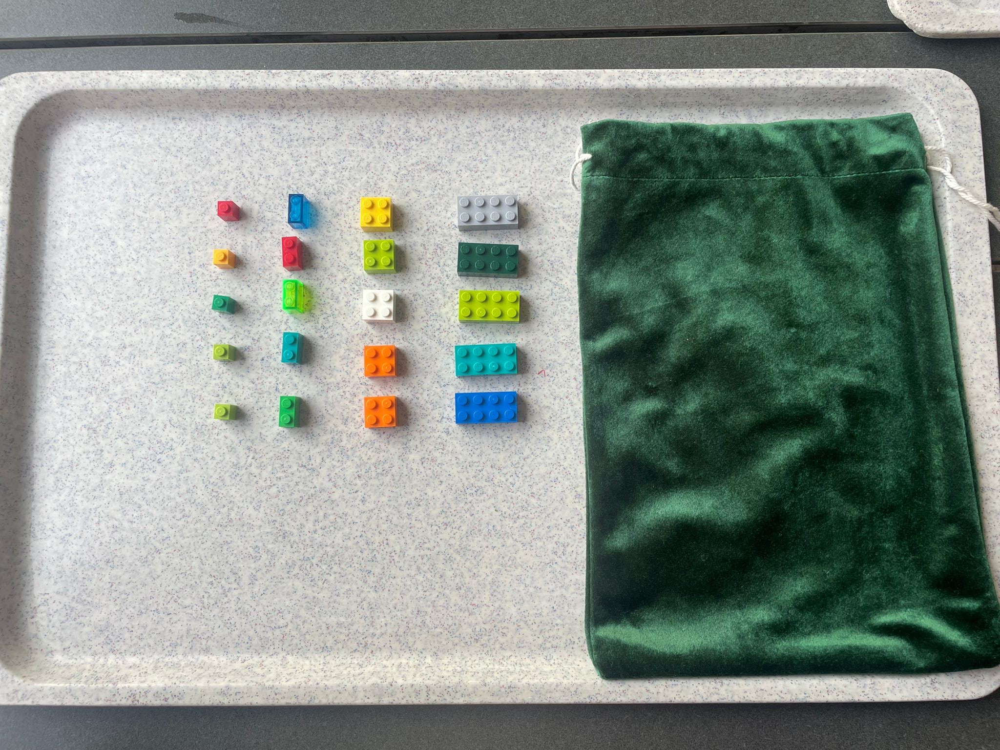

# Week 2 
The Experiment conceived was mutliple people drawing a single lego-piece from 
a bag containing multiple sizes. Possible sizes where: 1, 2, 4, 8, 
all being multiples of another. After Drawing one Piece it was put back into 
the bag. A total of 62 Participants were asked.



## Setup
```{r}
library(tidyverse)
library(ggplot2)

# set this to your path
#setwd(r"(C:\Users\Valen\Documents\Git-Repositorys\TUHH\Applied Statistics\week02)")
getwd()

experiment_data <- read.table("Week_2_Experiment.csv", header=TRUE)


```


## Evaluating the Real Experiment
### Frequencies
```{r}
freq_real <- table(factor(experiment_data$PieceSize, levels = c(1, 2, 4, 8)))
freq_real_df <- as.data.frame(freq_real)
colnames(freq_real_df) <- c("size", "count")

freq_real_df <- freq_real_df |> mutate(percent = (count/sum(count)*100))

freq_real_df$size <- as.numeric(as.character(freq_real_df$size))

ggplot(freq_real_df, aes(x=size, y=count)) +
  geom_col(width = 0.2) +
  geom_point(size = 3, color = "red") +
  geom_smooth(
    method = "lm",
    color = "blue",
    se = FALSE,
    linetype = 2
  ) +
  scale_x_continuous(
    breaks = 1:8
  ) +
  labs(
    title = "Real Data from Drawn Pieces",
    x = "Size of drawn piece",
    y = "Number of times the size was drawn"
  ) +
  theme_minimal() 


real_data_percent <- ggplot(freq_real_df, aes(x=size, y=percent)) +
  geom_col(width = 0.2) +
  geom_point(size = 3, color = "red") +
  geom_smooth(
    method = "lm",
    color = "blue",
    se = FALSE,
    linetype = 2
  ) +
  scale_x_continuous(
    breaks = 1:8
  ) +
  labs(
    title = "Real Data from Drawn Pieces",
    x = "Size of drawn piece",
    y = "Percentage of total draws"
  ) +
  theme_minimal() 


ggsave("percentage_of_total_draws_real.png")
  
```
### Mean Value and Variance and skweness etc.
```{r}
mean_value_real <- mean(experiment_data$PieceSize)
freq_variance_real <- var(freq_real_df$count) 
```

## Simulating the Theoretical Experiment
```{r}
outcomes <- c(1, 2, 4, 8)
P_uniform<- c(0.25, 0.25, 0.25, 0.25)

set.seed(4)
sizes_sim <- sample(outcomes, size=62, replace=TRUE, prob=P_uniform)

freq_sim <- table(factor(sizes_sim, levels=outcomes))
freq_sim_df <- as.data.frame(freq_sim)
colnames(freq_sim_df) <- c("size", "count")

freq_sim_df <- freq_sim_df |>
  mutate(
    size = as.numeric(as.character(size)),
    count = as.numeric(as.character(count))
  ) |>
  mutate(percent = count/sum(count)*100)

ggplot(freq_sim_df, aes(x=size, y=percent))+
  geom_col(width = 0.2) +
  geom_point(size = 3, color = "red") +
  geom_smooth(
    method = "lm",
    color = "blue",
    se = FALSE,
    linetype = 2
  ) +
  scale_x_continuous(
    breaks = 1:8
  ) +
  labs(
    title = "Simulated Data from Drawn Pieces, N = 62",
    x = "Size of drawn piece",
    y = "Percent of times the size was drawn"
  ) +
  theme_minimal() 
```
### Expected Value and Variance
```{r}
mean_value_sim <- mean(sizes_sim)
freq_variance_sim <- var(freq_sim_df$count) # ? makes sense?
expected_value_sim <- sum(outcomes*P_uniform)
```
## Assume Linear Model
The probability P_i of a piece being drawn is the proportional to its size s.
We have four pieces with sizes \( s_i \in \{1, 2, 4, 8\} \).

\[
s_{\text{total}} = \sum_{i \in \{1, 2, 4, 8\}} s_i = 1 + 2 + 4 + 8 = 15
\]

\[
P_i = \frac{s_i}{s_{\text{total}}}
\]

\[
P_1 = \frac{1}{15}, \quad
P_2 = \frac{2}{15}, \quad
P_4 = \frac{4}{15}, \quad
P_8 = \frac{8}{15}
\]

Expected Size drawn:
```{r}
sizes = c(1, 2, 4, 8)
P_proportional = sizes/sum(sizes)
expected_value_linear = P_proportional %*% sizes
print(expected_value_linear)
```
Expected Number of Draws for each piece for \(N = 62\):
```{r}
N <- 62
expected_draws_uniform <- N * P_uniform
expected_draws_proportional <- N * P_proportional


expected_counts <- ggplot(freq_real_df, ) +
  geom_point(aes(x = size, y = count, color = "Observed"), size = 3) + 
  geom_point(aes(x = size, y = expected_draws_proportional, color = "Proportional Model"),
             size = 3) +
  geom_point(aes(x = size, y = expected_draws_uniform, color = "Uniform Model"),
             size = 3) +
  geom_smooth(aes(x = size, y = count, color = "Observed"),
              method = lm, se = FALSE, linetype = 3) + 
  geom_smooth(aes(x = size, y = expected_draws_proportional, color = "Proportional Model"),
              method = lm, se = FALSE, linetype = 2) +
  geom_smooth(aes(x = size, y = expected_draws_uniform, color = "Uniform Model"),
              method = lm, se = FALSE, linetype = 2) +
  labs(title = "Comparing the experiments results to the Expected Counts for N=62",
       color = "Type",
       x = "Size of the drawn piece",
       y = "Expected Count") +
  scale_color_manual(values = c("Observed" = "black",
                                "Uniform Model" = "blue",
                                "Proportional Model" = "red")) +
  theme_minimal()

expected_counts
ggsave("expected_counts.png", expected_counts)

```

## Perform Chi Squared Test to evaluate goodness of fit
```{r}
observed_counts <- freq_real_df$count

test_uniform <- chisq.test(x = observed_counts, p = P_uniform)
test_proportional <- chisq.test(x = observed_counts, p = P_proportional)

print(test_uniform)
print(test_proportional)
```
We see a High \(X^2\) Value for the uniform model with a very low p-value, proving the 
uniform model to not be a good fit.

The \(X^2 = 5.076\) Value for the proportional Model however is significantly lower and 
smaller than 7.815, which represents the critical value for 3 degrees of freedom. 
The p-value is significant.

**The proportional model is a plausible and good fit for our data.**

### Reasons for no drawings of the small 1-Piece

  - Stuck in the corners of the bag
  - Fast decision of the participants
  - very difficult to grab
  - people might think its too small to be random